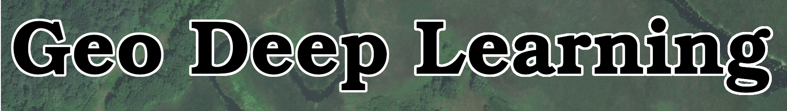
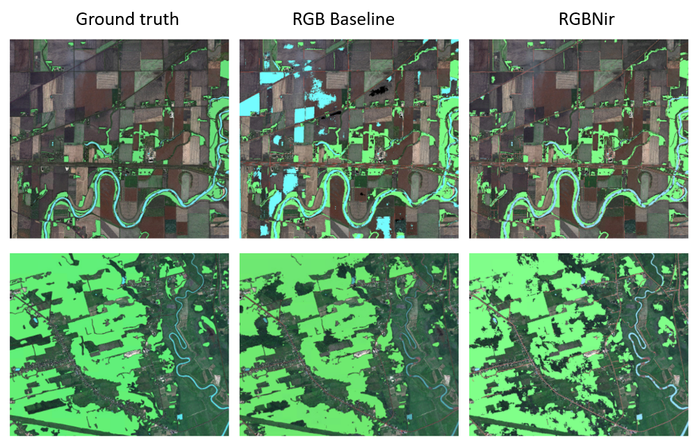

## **Overview**

The **geo-deep-learning** project stems from an initiative at NRCan's [CCMEO](https://www.nrcan.gc.ca/earth-sciences/geomatics/10776).  Its aim is to allow using Convolutional Neural Networks (CNN) with georeferenced data sets.
The overall learning process comprises three broad stages:

### Data preparation ([images_to_samples.py](images_to_samples.py))
The data preparation phase (sampling) allows creating sub-images that will be used for either training, validation or testing.

The first phase of the process is to determine sub-images (samples) to be used for training, validation and, optionally, test.  Images to be used must be of the geotiff type.  Sample locations in each image must be stored in a GeoPackage.

> Note: A data analysis module can be found [here](./utils/data_analysis.py) and the documentation in [`docs/README.md`](./docs/README.md). Useful for balancing training data.

### Training, along with validation and testing ([train_segmentation.py](train_segmentation.py))
The training phase is where the neural network learn to use the data prepared in the previous phase to make all the predictions.
The crux of the learning process is the training phase.  

- Samples labeled "*trn*" as per above are used to train the neural network.
- Samples labeled "*val*" are used to estimate the training error (i.e. loss) on a set of sub-images not used for training, after every epoch.
- At the end of all epochs, the model with the lowest error on validation data is loaded and samples labeled "*tst*", if they exist, are used to estimate the accuracy of the model on sub-images unseen during training or validation.

### Inference ([inference.py](inference.py))
The inference phase allows the use of a trained model to predict on new input data.
The final step in the process is to assign every pixel in the original image a value corresponding to the most probable class.

> The training and inference phases currently allow the use of a variety of neural networks to perform classification and semantic segmentation tasks (see the list in [models](models/)).

**For more informations on a subject, go to the specific directory, a `README.md` is provided with all the informations and the explanations related to the code.**

## **Requirement**
This project comprises a set of commands to be run at a shell command prompt.  Examples used here are for a bash shell in an Ubuntu GNU/Linux environment.

- [Python 3.6](https://www.python.org/downloads/release/python-360/), see the full list of dependencies in [requirements.txt](requirements.txt)
- [mlflow](https://mlflow.org/)
- [minicanda](https://docs.conda.io/en/latest/miniconda.html) (highly recommended)
- nvidia GPU (highly recommended)

> The system can be used on your workstation or cluster and on [AWS](https://aws.amazon.com/).

## **Installation**
Those step are for your a workstation on Ubuntu 18.04 using miniconda.
Set and activate your python environment with the following commands:  
```shell
conda create -n gpu_ENV python=3.6 -c pytorch pytorch torchvision
conda activate gpu_ENV
conda install --override-channels -c main -c conda-forge ruamel_yaml h5py fiona rasterio geopandas scikit-image scikit-learn tqdm
conda install -c fastai nvidia-ml-py3
conda install mlflow segmentation-models-pytorch
```
> For Windows OS:
> - Install rasterio, fiona and gdal first, before installing the rest. We've experienced some [installation issues](https://github.com/conda-forge/gdal-feedstock/issues/213), with those libraries.
> - Mlflow should be installed using pip rather than conda, as mentionned [here](https://github.com/mlflow/mlflow/issues/1951)  

## **Folder Structure**
We suggest a high level structure to organize the images and the code.
```
├── {dataset_name}
    └── data
        └── RGB_tiff
            └── {3 band tiff images}
        └── RGBN_tiff
            └── {4 band tiff images}
        └── gpkg
            └── {GeoPackages}
    └── images.csv
    └── yaml_files
            └── your_config.yaml
            ...
            └── different_config.yaml
├── geo-deep-learning
    └── {scripts as cloned from github}
```


## **Running GDL**
1. Clone this github repo.
```shell
git clone https://github.com/NRCan/geo-deep-learning.git
cd geo-deep-learning
```

2. Copy the file `config/config_template.yaml`, rename it `your_config.yaml` and change the parameters for your needs.
Prepare your data directory and add the paths to a `csv` file.
```shell
# Copying the config_template and rename it at the same time
cp config/config_template.yaml path/to/yaml_files/your_config.yaml
# Creating the csv file
touch path/to/images.csv  
```
> See the documentation in the [`config/`](config/) directory for more information on how to fill the [`yaml`](config/#Preparation-of-the-yaml-file) and [`csv`](config/#Preparation-of-the-csv-file) files.

3. Execute your task (can be use separately).
```shell
# Creating the hdf5 from the raw data
python images_to_samples.py path/to/yaml_files/your_config.yaml
# Training the neural network
python train_segmentation.py path/to/yaml_files/your_config.yaml
# Inference on the new data
python inference.py --param path/to/yaml_files/your_config.yaml
or 
python inference.py --input path/to/your_checkpoint.pth.tar /path/to/images/
```
> If you only want to use the `inference.py` you dont have to fill all the `yaml` file, only fill the inference section.


<!-- ## Mettre des exemples de predictions obtenues sur nos jeux de donn/es -->


---

## **Segmentation on RGB-NIR images with transfer learning**



This section present a different way to use a model with RGB-Nir images. For more informations on the implementation, see the article [Transfer Learning from RGB to Multi-band Imagery](https://www.azavea.com/blog/2019/08/30/transfer-learning-from-rgb-to-multi-band-imagery/) frome [Azavea](https://www.azavea.com/).

Specifications on this functionality:
- At the moment this functionality is only available for the [Deeplabv3 (backbone: resnet101)](https://arxiv.org/abs/1706.05587)
- You may need to reduce the size of the `batch_size` to fit everything in the memory.

To use this functionality, you will need to change the `global` section of your `yaml` file. The parameters to use this module are:
```yaml
# Global parameters
global:
  samples_size: 256
  num_classes: 4  
  data_path: /home/cauthier/data/
  number_of_bands: 4               # <-- must be 4 for the R-G-B-NIR
  model_name: deeplabv3_resnet101  # <-- must be deeplabv3_resnet101
  bucket_name:
  task: segmentation               # <-- must be a segmentation task
  num_gpus: 2
  BGR_to_RGB: False                # <-- must be already in RGB
  scale_data: [0,1]
  aux_vector_file:
  aux_vector_attrib:
  aux_vector_ids:
  aux_vector_dist_maps:
  aux_vector_dist_log:
  aux_vector_scale:
  debug_mode: True
  coordconv_convert: False
  coordvonc_scale:

  # Module to include the NIR
  modalities: RGBN                 # <-- must be add
  concatenate_depth: 'layer4'      # <-- must specify the point where the NIR will be add
```

The rest of the `yaml` don't have to change.The major changes are the `modalities`, `number_of_bands` and `concatenate_depth` parameters.
If the model select is not `model_name: deeplabv3_resnet101`, but the `number_of_band = 4` and the `modalities = RGBN`, the model will train with the chosen architecture with a input image of 4 dimensions.

Since we have the concatenation point for the **NIR** band only for the `deeplabv3_resnet101`, the `concatenate_depth` parameter option are layers in the `resnet101` backbone: 'conv1', 'maxpool', 'layer2', 'layer3' and 'layer4'.

**Illustration of the principle will fellow soon**
