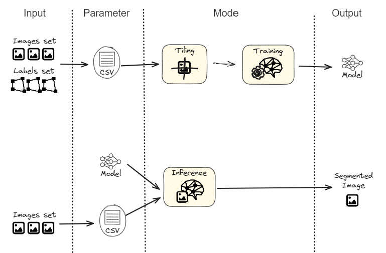

.. _modeindex:

Mode
++++

The **mode** represent the assignment that you give to the code. 

The following schema describes GDL's modes and concepts.  

.. _datatiling:

Data Tiling
-----------

.. code-block:: console

   # Creating the patches from the raw data
   (geo_deep_env) $ python GDL.py mode=tiling

The data `tiling <https://torchgeo.readthedocs.io/en/latest/user/glossary.html#term-tiling>`_
preparation phase creates `chips <https://torchgeo.readthedocs.io/en/latest/user/glossary.html#term-chip>`_ 
(or patches) that will be used for either training, validation or testing with the dataloader.
For this tiling step, **GDL** requires a csv as input with a list of rasters and labels to be
used in the subsequent training phase.
This csv must have been specified as a ``path`` in the ``raw_data_csv`` from :ref:`configurationgeneralparam`.
The other parameters will be found in :ref:`configurationdefaultparam` under ``tiling`` and 
this configuration file looks like:

.. literalinclude:: ../../../config/tiling/default_tiling.yaml
   :language: yaml

- ``tiling_data_dir`` (str)
    This directory defines where output patches will be written, the value is read from the from
    ``tiling_data_dir`` in :ref:`configurationgeneralparam`.
- ``train_val_percent`` (dict)
    This parameter defines the proportion of patches to be redirected to the validation set,
    ``{'trn':0.7, 'val':0.3}`` means around 30% of patches will belong to validation.
- ``patch_size`` (int)
    Size of an individual patch. For example, a raster of 1024 x 1024 pixels will output 4 patchs 
    if patch_size is 512. The value for this parameter should remain relatively stable as varying 
    patch sizes has little impact on the performance of model. Tiling is mostly aimed at making it 
    possible to fill a batch with at least 4 patch pairs of different AOIs without busting a 
    machine's memory while training. Defaults to 512.
- ``min_annot_perc`` (int) 
    Minimum annotated percent, discards patch pairs (imagery & ground truth) if the non-background 
    area (e.g. area covered with classes of interest) on a given ground truth patch is lower than 
    this minimum. Defaults to 0 (keep all patchs). This parameter is a data balancing tool for 
    undersampling. It is easy to implement and use, but may not be the perfect solution for all data
    balancing problems. For more information on pros and cons of undersampling, oversampling and other 
    class balancing strategies, see 
    `Buda & Al., 2018 <https://www.sciencedirect.com/science/article/pii/S0893608018302107?casa_token=1gtjUgWc6pUAAAAA:SUDHxtgD8SPDrsM4wR93mH6ZYW57Mr-BYX2nBwxTuT8DsUlWJcvpAV1vgdACQgY78IbiZuCrPgb_>`_
    and `Longadge & Dongre, 2013 <https://arxiv.org/pdf/1305.1707>`_.
- ``continuous_values`` (bool)
    If True, the tiling script will ensure all pixels values in the rasterized ground truth have 
    continuous values starting at 1 (0 being background). 
    In most cases, this parameter has no impact as values may already be continuous. However, it becomes 
    useful to set to ``True`` when filtering polygons from a ground truth file using
    an attribute field and attribute values (see the dataset section). For example, filtering values
    ``[2,4]`` from a given attribute field will create ground truth rasterized patches with these same 
    discontinuous values, unless the value is ``True``. 
    If you choose to set to ``False``, errors may occur in metrics calculation, 
    training and outputted values at inference. We strongly recommend keeping the default ``True`` value.
- ``save_preview_labels`` (bool)
    If True, a ``.png`` copy of rasterized ground truth patches will be written for quick visualization. 
    A colormap is used to map actual values in ``.geotiff`` ground truth patch (usually very close to 0, 
    thus hard to visualize with a system viewer). However, the conversion from ``.geotiff`` to ``.png``
    discard the georeferencing information. If one wishes to locate a particular patch, it is recommended 
    to open the .geotiff version of ground truth patch in a GIS software like QGIS.  
- ``multiprocessing`` (bool)
    If True, the tiling script uses Python's multiprocessing capability to process each AOI in parallel. 
    This greatly accelerates the tiling process. For testing or debugging purposes or for small dataset, 
    we'd recommend keeping the default value ``False``.
- ``clahe_clip_limit`` (int)
    Our teams empirical tests have shown that, in most satellite imagery with right skewed histogram 
    (ex.: most of Worldview imagery), histogram equalization with the 
    `CLAHE algorithm <https://srv2.freepaper.me/n/OH5z7hgkxfyC4zO_hufz5Q/PDF/03/0347192c1b9db2b2f55a5d329a5e4a53.pdf>`_
    improves the performance of models and subsequent quality of extractions. 
    After having compared `Kornia's <https://kornia.readthedocs.io/en/v0.5.0/enhance.html?highlight=clahe#kornia.enhance.equalize_clahe>`_
    and `Scikit-image's <https://scikit-image.org/docs/stable/api/skimage.exposure.html#skimage.exposure.equalize_adapthist>`_ 
    implementation on 3 RGB images of varying sizes, the geo-deep-learning team has favored *Kornia's CLAHE*.
- ``write_dest_raster`` (bool)
    If True, the destination raster will be written in the AOI's root directory (see AOI's class docstrings).
    Defaults to ``False``, when bands requested don't require a VRT to be created, no destination raster
    is written even if ``True`` since the destination raster would be identical to the source raster.
    If a VRT is required, but ``False``, no destination raster is written to disk. This feature is currently 
    implemented mostly for debugging and demoing purposes. 
- ``write_mode`` (str)
    Defines behavior in case patches already exist in destination folder for a particular dataset. Modes 
    available are "raise_exists" (by default, tiling will raise error if patches already exist) and "append"
    (tiling will skip AOIs for which all patches already exist). This feature is applies to 1st step of 
    tiling only, does not apply to 2nd step (filtering, sorting among trn/val and burning vector ground truth 
    patches).

.. note::

    Kornia expects "*clip_limit*" as a float with default value at 40. Because sk-image's implementation 
    expects this parameter to be between 0 and 1, geo-deep-learning forces user to input an integer as 
    "*clip_limit*". This is meant to reduce the potential confusion with sk-image's expected value.

.. _training:

Training
--------

.. code-block:: console

   # Training the neural network
   (geo_deep_env) $ python GDL.py mode=train

Training, along with validation and testing phase is where the neural network learns, from the data prepared in 
the tiling mode to make all the predictions. The crux of the learning process is the training phase.  
During the training the data are separated in three datasets for training, validation and test. The samples labeled "*trn*"
as per above are used to train the neural network. The samples labeled "*val*" are used to estimate the training
error (i.e. loss) on a set of sub-images not used for training. After every epoch and at the end of all epochs, 
the model with the lowest error on validation data is loaded and use on the samples labeled "*tst*" if they exist.
The result of those "*tst*" images is used to estimate the accuracy of the model, since those images were 
unseen during training nor validation.
For all those steps, we have the parameters that can be found in :ref:`configurationdefaultparam` under ``training``
and this configuration file looks like:

.. literalinclude:: ../../../config/training/default_training.yaml
   :language: yaml

- ``num_gpus`` (int)
    Number of GPUs used for training. The value does not matter if Pytorch is installed cpu-only. 
- ``batch_size`` (int)
    Number of training tiles in one forward/backward pass.
- ``eval_batch_size`` (int)
    Number of validation tiles in one forward/backward pass.
- ``batch_metrics`` (int)
    Compute metrics every n batches. If set to 1, will calculate metrics for every batch during validation. Calculating 
    metrics is time-consuming, therefore it is not always required to calculate it on every batch, for every epoch. 
- ``lr`` (float) 
    Learning rate at first epoch.
- ``max_epochs`` (int)
    Maximum number of epoch for one training session. 
- ``min_epochs`` (int)
    Minimum number of epoch for one training session.
- ``num_workers`` (int, optional)
    Number of workers assigned for the dataloader. If not provided, will be deduced from the number of GPU (num_workers = 4 * num_GPU). 
    `References <https://discuss.pytorch.org/t/guidelines-for-assigning-num-workers-to-dataloader/813/5>`_
- ``mode`` (str)
   'min' or 'max', will minimize or maximize the chosen loss.
- ``max_used_ram`` (int, optional)
    Used to calculate wether or not the process can use the GPU. If a GPU is already used by another process, the training can still be 
    pushed to this GPU if ``max_used_ram`` is not met. 
- ``max_used_perc`` (int, optional)
    Value between 0-100. Used to calculate wether or not the process can use the GPU. If a GPU is already used by another process, 
    the training can still be pushed to this GPU if ``max_used_perc`` is not met. 
- ``state_dict_path`` (str, optional)
    Path to a pretrained model (.pth.tar).
- ``state_dict_strict_load`` (bool, optional)
    Defines whether to strictly enforce that the keys in state_dict match the keys returned by this Pytorch's state_dict() function. 
    Default: True. `Reference <https://pytorch.org/docs/stable/generated/torch.nn.Module.html#torch.nn.Module.load_state_dict>`_
- ``compute_sampler_weights`` (bool, optional)
    If provided, estimate sample weights by class for unbalanced datasets. 
    Uses `Sk-learn <https://scikit-learn.org/stable/modules/generated/sklearn.utils.class_weight.compute_sample_weight.html>`_

.. _inference:

Inference
---------

.. code-block:: console

   # Inference on the data
   (geo_deep_env) $ python GDL.py mode=inference

The inference phase is the last one, it allows the use of a trained model to predict on new input data without
ground truth. For this final step in the process, it need to assign every pixel in the original image a value 
corresponding to the most probable class with a certain level of confidence. Like the other two mode, the parameter 
will be found in :ref:`configurationdefaultparam` under ``inference`` and this configuration file looks like 
(for binary inference):

.. literalinclude:: ../../../config/inference/default_binary.yaml
   :language: yaml

- ``raw_data_csv`` (str)
    Path to the images csv.
- ``root_dir`` (str)
    Directory where outputs and downloads will be written by default,
    if ``checkpoint_dir`` or ``output_path`` are omitted.
- ``raw_data_csv`` (str)
    Points to a csv containing paths to imagery for inference. If a ground truth is present in 2nd column,
    it will be ignored.
- ``input_stac_item`` (str)
    A path or url to :ref:`stac item <datasetstacitem>` directly. 
    See stac item example for `Spacenet test data <https://datacube-stage.services.geo.ca/api/collections/spacenet-samples/items/SpaceNet_AOI_2_Las_Vegas-056155973080_01_P001-WV03>`_, 
    also contained in `test data <https://github.com/NRCan/geo-deep-learning/tree/develop/tests/data/spacenet.zip>`_.
- ``state_dict_path`` (str)
    Path to checkpoint containing trained weights for a given neural network architecture.
- ``output_path`` (str, optional)
    Complete path including parent directories and full name with extension where output inference should
    be saved. By default ``root_dir/{aoi.aoi_id}_pred.tif`` (see :ref:`AOI documentation <dataset>`), the 
    ``output_path`` parameter should only be used if a single inference is being performed. Otherwise, it 
    is recommended to set the root_dir and use the default output name.  
- ``checkpoint_dir`` (str)
    Directory in which to save the checkpoint file if url.
- ``chunk_size`` (int)
    Size of chunk (in pixels) to read use for inference iterations over input imagery. The input patch will
    be square, therefore set at ``512`` it will generate 512 x 512 patches.
- ``max_pix_per_mb_gpu`` (int)
    If chunk_size is omitted, this defines a "*maximum number of pixels per MB of GPU Ram*" that should be 
    considered. E.g. if GPU has 1000 Mb of Ram and this parameter is set to 10, chunk_size will be set to 
    ``sqrt(1000 * 10) = 100``. By defaults it's set to 25. Since this feature is based on a rule-of-thumb 
    and assumes some prior empirical testing. WIP. 
- ``prep_data_only`` (bool)
    If True, the inference script will exit after preparation of input data.
    If checkpoint path is url, then the checkpoint will be download, if imagery points to urls, it will be 
    downloaded and if input model expects imagery with :ref:`histogram equalization <datatiling>`, this 
    enhancement is applied and equalized images save to disk.
- ``gpu`` (int)
    Number of gpus to use at inference. 
- ``max_used_perc`` (int)
    If GPU's usage exceeds this percentage, it will be ignored. For example, if you have a process already running
    on ``GPU:0`` before running your script, if the first process takes up more than any of these values, ``GPU:0`` 
    will be ignored and it will try to push your new process on another GPU.
- ``max_used_ram`` (int)
    If RAM usage of detected GPU exceeds this percentage, it will be ignored.
- ``ras2vec`` (bool)
    If True, a polygonized version of the inference ``.gpkg`` will be created with rasterio tools.

.. note:: 

    Current implementation doesn't support a number of GPU superior to 1 at inference. 

